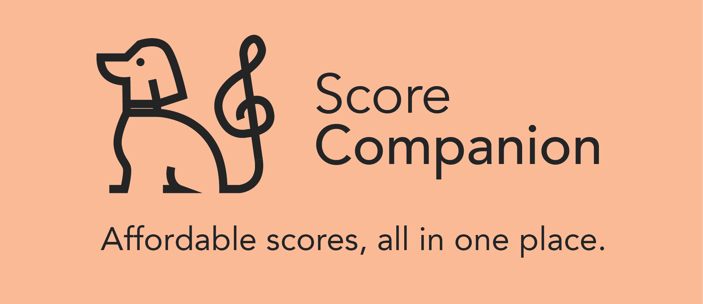

<a href="https://www.scorecompanion.com">

  

  </a>

# What is Score Companion?
Score Companion is a free tool for searching for sheet music across a variety of popular sites. The site includes a sleek and responsive search tool, with a GraphQL API and a PostgreSQL database on the backend. Score Companion has almost 700,000 records in its database, which will only grow as we continue to add more sites.

# Features
  - Free: Score Companion was created to help every musician find the sheet music they need, and will always be free to use.
  - Fast: Score Companion leverages the power of a custom GraphQL API to quickly search scores across a wide variety of sites.
  - Responsive: Search Companion was designed to work on every device, providing a much better experience compared to many of the out-of-date sheet music sites of today.
  
# Requirements
Just head on over to www.scorecompanion.com and search for the scores you need!

# FAQ
### Can I take a look at or use Score Companion's GraphQL API?
As of now, the API is available to everyone to use, although it is currently a work in progress. You can find it at https://api.scorecompanion.com, where you can browse the API through the GraphQL playground.
